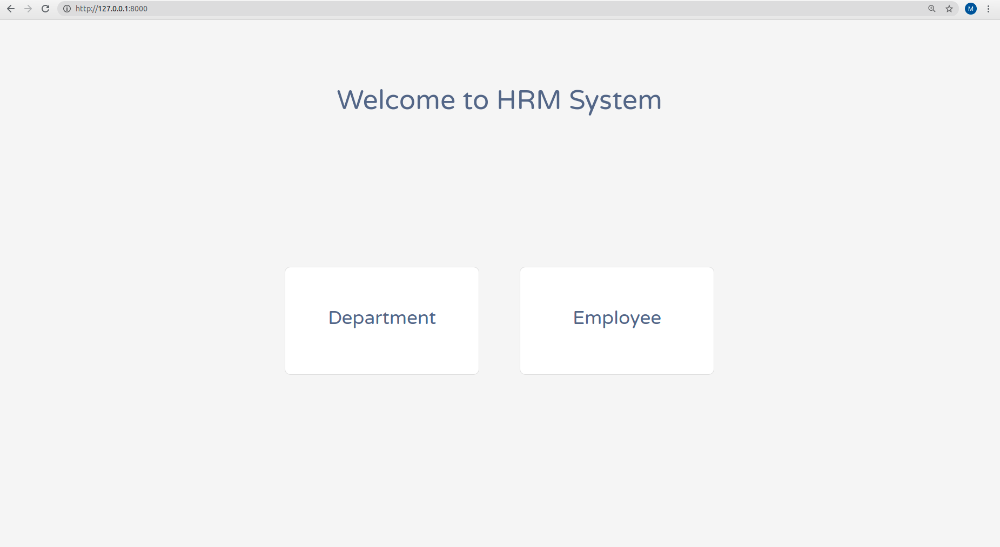

# Django Crud APP
<h5>Please follow the steps to run the code.</h5>

It is the sample django app for CRUD operations for Human Resource Management system

## Installation

Use the package manager [pip](https://pip.pypa.io/en/stable/) to install django.\
Try to run the project by enterin the command "python3 manage.py runserver" if not working then
Please follow these steps to run the application.

1) Download the project and extract it in the directory.
2) Open the terminal and go into the directory where project is extracted.
3) Enter command "python3 manage.py migrate"
4) Enter command "python3 manage.py makemigrations"
5) Enter command "python3 manage.py runserver" 

Done

Following are the screenshots of projects.

